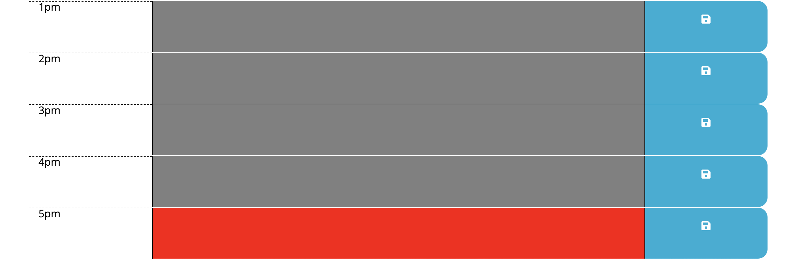

# Work Day Scheduler

## Description

The workday scheduler is an application in which the user can use this daily calendar to save events for the hours of a typical 9-5 workday.




## User story

``` 
AS AN employee with a busy schedule
I WANT to add important events to a daily planner
SO THAT I can manage my time effectively

```


## Table of Contents
            
* [Installation](#Installation)
* [Built With](#Usage) 


## Installation

If you'd like to get a copy of the project up and running on your local machine for development and testing purposes, follow the instructions below.


### Git clone the repository to your local machine:

 git clone https://github.com/ablizben/scheduler


## Built With

- HTML
- CSS
- [jQuery] (https://jquery.com/) - JavaScript Library
- [Bootstrap] (https://getbootstrap.com/) - CSS framework directed at responsive, mobile-first front-end web development.
